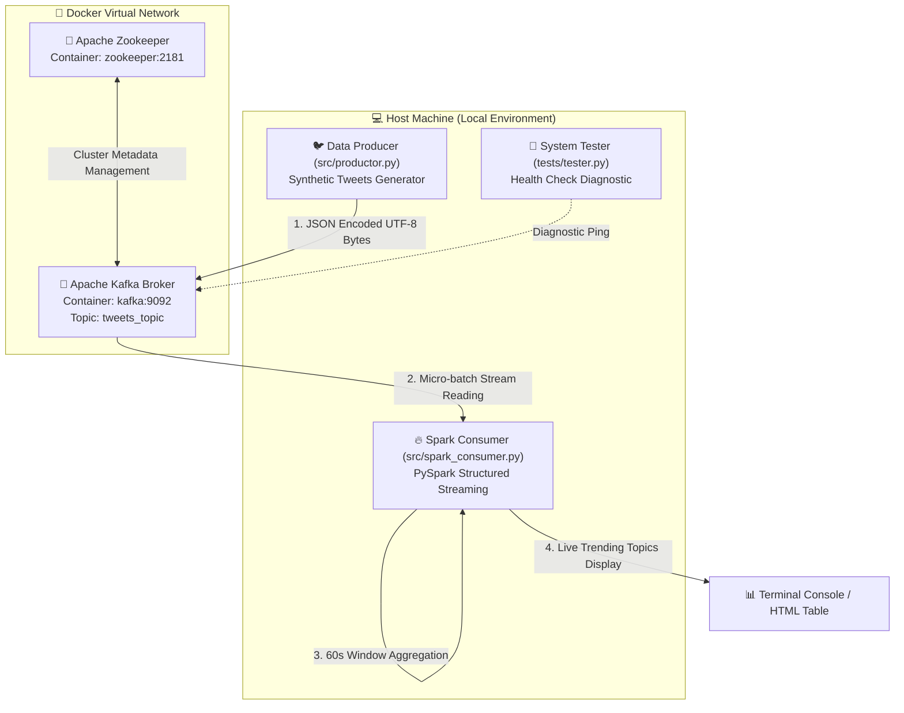
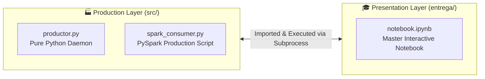

# 🚀 Real-Time Big Data Streaming Architecture (Kafka + PySpark)

[](https://www.python.org/)
[](https://www.docker.com/)
[](https://kafka.apache.org/)
[](https://spark.apache.org/)
[]()

An end-to-end, enterprise-grade **Real-Time Data Streaming Pipeline** designed to simulate social media traffic (Twitter/X) and process live **Trending Topics** instantaneously. Built on top of a single-node virtualised container cluster (Docker Compose), this project decouples continuous data ingestion from micro-batch stream aggregation using **Apache Kafka** and **PySpark Structured Streaming**.

---

## 📌 Table of Contents

- [Project Purpose \& Key Features](#-project-purpose--key-features)
- [Team Structure \& Responsibilities](#-team-structure--responsibilities)
- [System Architecture \& Data Flow](#-system-architecture--data-flow)
- [Data Schema \& Message Payload](#-data-schema--message-payload)
- [Directory Hierarchy](#-directory-hierarchy)
- [Prerequisites \& Environment Setup](#-prerequisites--environment-setup)
- [Step-by-Step Deployment \& Execution](#-step-by-step-deployment--execution)
- [Verification \& Health Testing](#-verification--health-testing)
- [Dual-Layer Architecture (Scripts vs. Notebook)](#-dual-layer-architecture-scripts-vs-notebook)
- [Troubleshooting \& Infrastructure Teardown](#-troubleshooting--infrastructure-teardown)
- [Conclusions \& Batch vs. Streaming Analysis](#-conclusions--batch-vs-streaming-analysis)

---

## 🎯 Project Purpose & Key Features

Modern enterprise data architectures rely on **Streaming Processing** to gain actionable insights within seconds rather than processing static batches overnight. This project demonstrates a production-oriented Lambda/Kappa streaming layer:

- **Decoupled Architecture:** High-throughput producer writes synthetic events to Kafka without blocking; PySpark consumes events asynchronously.
- **Resilient Containerisation:** Fully virtualised cluster deploying Zookeeper and Kafka via Docker Compose with external port mapping.
- **Tumbling Time-Window Aggregations:** PySpark Structured Streaming groups event streams into 60-second fixed windows recalculated every 10 seconds.
- **Watermarking & Late Data Handling:** 2-minute event watermark to discard out-of-order/stale messages efficiently.
- **Dual Execution Modes:** Clean modular Python scripts (`src/`) for production deployment alongside an interactive Jupyter Notebook (`entrega/notebook.ipynb`) for academic presentation.

---

## 👥 Team Structure & Responsibilities

| Contributor | Specialized Role | Primary Focus & Deliverables |
| :--- | :--- | :--- |
| **Samuel Corrionero** | **Infrastructure Architect** | Docker virtualization, Zookeeper & Kafka networking, port-forwarding (`KAFKA_ADVERTISED_LISTENERS`), system health tester script. |
| **Ismael González Loro** | **Data Ingestion Engineer** | Synthetic social media generator (`src/productor.py`), JSON serialization, randomized distribution logic, and rate throttling. |
| **Jairo Pabel Farfán Callau**| **Spark Streaming Engineer** | PySpark consumer (`src/spark_consumer.py`), StructType schema definition, 60s tumbling windows, 2m watermarks, `foreachBatch` output. |
| **Yahya El Baroudi** | **Documentation Lead** | Master presentation notebook (`notebook.ipynb`), subprocess orchestration, live HTML display tables, defense presentation slides. |

---

## 🏗️ System Architecture & Data Flow

The following sequence details how synthetic social media traffic flows from Python through Dockerized Kafka into PySpark for windowed trending topic computation:



### Component Details

1. **Apache Zookeeper (`localhost:2181`):** Coordinates broker leader election, maintains configuration states, and tracks node health.
2. **Apache Kafka Broker (`localhost:9092`):** Serves as a high-speed buffer storing incoming streaming messages under topic `tweets_topic`. Configured with `PLAINTEXT://localhost:9092` advertised listeners so external host Python scripts can communicate seamlessly with containerised services.
3. **Synthetic Producer (`src/productor.py`):** Generates 1 tweet/second simulating user handles, tweet text, primary hashtag, and precise timestamps.
4. **Spark Structured Streaming (`src/spark_consumer.py`):** Reads micro-batches, parses JSON payload against an explicit schema, creates a 60-second tumbling time window, applies a 2-minute watermark, and outputs the top trending hashtags ordered by frequency.

---

## 📄 Data Schema & Message Payload

### 1. JSON Payload Structure (Producer Output)

Each event published to `tweets_topic` follows a clean, structured JSON format:

```json
{
  "usuario": "@SparkGuru",
  "texto": "increíble la velocidad de #Spark",
  "hashtag_principal": "#Spark",
  "timestamp": 1733940000.125
}
```

### 2. PySpark StructType Schema (Consumer Input)

To ensure zero schema drift and optimal parsing performance, the Spark Consumer enforces an explicit structure:

```python
from pyspark.sql.types import StructType, StructField, StringType, DoubleType

schema = StructType([
    StructField("usuario", StringType(), True),
    StructField("texto", StringType(), True),
    StructField("hashtag_principal", StringType(), True),
    StructField("timestamp", DoubleType(), True)
])
```

---

## 🌳 Directory Hierarchy

```text
AE_spark-streaming/
├── docker/
│   └── docker-compose.yml       # Docker infrastructure recipe (Zookeeper + Kafka)
├── docs/
│   ├── memoria.md               # Complete project memory report (Markdown)
│   ├── memoria.pdf              # Generated academic report (PDF)
│   └── memoria.tex              # LaTeX source code for report
├── entrega/
│   ├── memoria.pdf              # Final submission document
│   ├── notebook.ipynb           # Master Jupyter Notebook (Interactive presentation)
│   └── Presentación .pdf        # Defense slides presentation
├── src/
│   ├── productor.py             # Synthetic Twitter data producer script
│   └── spark_consumer.py        # PySpark Structured Streaming consumer script
├── tests/
│   └── tester.py                # Infrastructure & Kafka connection tester
├── data/                        # Local data directory for dumps/logs
├── requirements.txt             # Python dependencies manifest
├── README.md                    # Project documentation (English)
└── .gitignore                   # Git exclusion configuration
```

---

## ⚙️ Prerequisites & Environment Setup

### 1. System Requirements

- **Operating System:** Linux / macOS / Windows 10+ (WSL2 recommended)
- **Docker Desktop / Docker Engine:** Version 24.0+
- **Java Runtime Environment (JRE/JDK):** Java 11 or 17 (Required by PySpark JVM)
- **Conda / Python:** Python 3.9+

### 2. Python Environment Installation

It is strongly recommended to set up an isolated Conda environment:

```bash
# Create dedicated environment named 'arqesp'
conda create --name arqesp python=3.9 -y

# Activate the environment
conda activate arqesp

# Install explicit project dependencies
pip install -r requirements.txt
```

---

## 🚀 Step-by-Step Deployment & Execution

Follow these steps in exact order to launch the full streaming pipeline.

### Step 1: Spin Up Infrastructure (Docker)

Launch Zookeeper and Kafka containers in detached mode:

```bash
# Navigate to project root directory
cd docker
docker compose up -d
```

Verify that both containers are active (`Up` state):

```bash
docker ps
```

### Step 2: Create Kafka Topic (`tweets_topic`)

*(Required only once during initial setup)*

```bash
docker exec -it kafka kafka-topics --create \
    --bootstrap-server localhost:9092 \
    --replication-factor 1 \
    --partitions 1 \
    --topic tweets_topic
```

### Step 3: Run Diagnostic Test

Verify host-to-container connectivity before starting the producer or consumer:

```bash
# From project root directory
python tests/tester.py
```

*Expected Output:* You should see `[✔] Sent` and `[✔] Received` messages confirming Kafka is ready.

### Step 4: Launch the Data Producer

Open a terminal window (with `arqesp` activated) and run:

```bash
python src/productor.py
```

*The producer will begin emitting 1 synthetic tweet per second into Kafka.*

### Step 5: Launch the Spark Streaming Consumer

Open **another** terminal window (with `arqesp` activated) and execute:

```bash
python src/spark_consumer.py
```

Every **10 seconds**, Spark will process accumulated micro-batches and render a live snapshot of top trending hashtags over the current 60-second window:

```text
========================================
Batch 4 - Snapshot at 2025-12-16 10:15:30
Window interval [10:14:30 , 10:15:30]
Top hashtags in this minute:
+-------------------+-----------------+---------------+
|window             |hashtag_principal|num_ocurrencias|
+-------------------+-----------------+---------------+
|{...}              |#Spark           |24             |
|{...}              |#BigData         |18             |
|{...}              |#RealTime        |14             |
|{...}              |#Python          |9              |
+-------------------+-----------------+---------------+
========================================
```

---

## 🧪 Verification & Health Testing

The system includes a dedicated verification script (`tests/tester.py`) that acts as a full-loop diagnostic:

1. **Producer Check:** Sends 5 test JSON messages to `tweets_topic` on `localhost:9092`.
2. **Consumer Check:** Instantiates a temporary Kafka consumer reading from `earliest` offset to confirm message persistence and retrieval.

```bash
python tests/tester.py
```

If any connection fails, the diagnostic script reports exact network status and troubleshooting hints.

---

## 🎓 Dual-Layer Architecture (Scripts vs. Notebook)

To balance production software standards with academic presentation guidelines, this project employs a **Dual-Layer Strategy**:



- **Production Layer (`src/`):** Contains modular, clean `.py` scripts optimized for continuous execution on headless servers or Kubernetes nodes.
- **Presentation Layer (`entrega/notebook.ipynb`):** A master Jupyter Notebook that controls Docker container startup using shell commands (`!docker compose`), runs the data generator asynchronously via `subprocess`, and renders live updating pandas HTML tables of Trending Topics using `IPython.display`.

---

## 🛠️ Troubleshooting & Infrastructure Teardown

### Common Issues & Solutions

1. **Port Binding Conflict (`port 9092 already in use`):**
   Ensure local Kafka or another service is not occupying port 9092. Stop conflicting processes or run `docker compose down`.
2. **PySpark JVM Error (`Java not found`):**
   Ensure Java 11 or 17 JDK is installed and `JAVA_HOME` is configured in system variables.
3. **Kafka Host Connectivity Timeout:**
   Confirm `KAFKA_ADVERTISED_LISTENERS` in `docker/docker-compose.yml` is set to `PLAINTEXT://localhost:9092`.

### Infrastructure Teardown Commands

When finishing work, stop the container cluster to free system memory:

```bash
# Graceful stop (persists container state)
docker compose -f docker/docker-compose.yml stop

# Complete cleanup (removes containers and Docker networks)
docker compose -f docker/docker-compose.yml down -v
```

---

## 📊 Conclusions & Batch vs. Streaming Analysis

| Feature | Traditional Batch (Hive / Pig / MapReduce) | Real-Time Streaming (Kafka + PySpark) |
| :--- | :--- | :--- |
| **Latency** | Hours / Days (Scheduled jobs) | Seconds / Sub-second (Continuous micro-batches) |
| **Data Processing** | Finite, static datasets | Infinite, unbounded event streams |
| **System Coupling** | High dependency on static storage | Fully decoupled via Kafka message broker |
| **Use Case Fit** | Historical reporting, monthly billing | Live trend detection, fraud prevention, alerts |

This architecture successfully validates how modern Big Data systems capture, transport, and analyze high-velocity event streams with low latency and high fault tolerance.